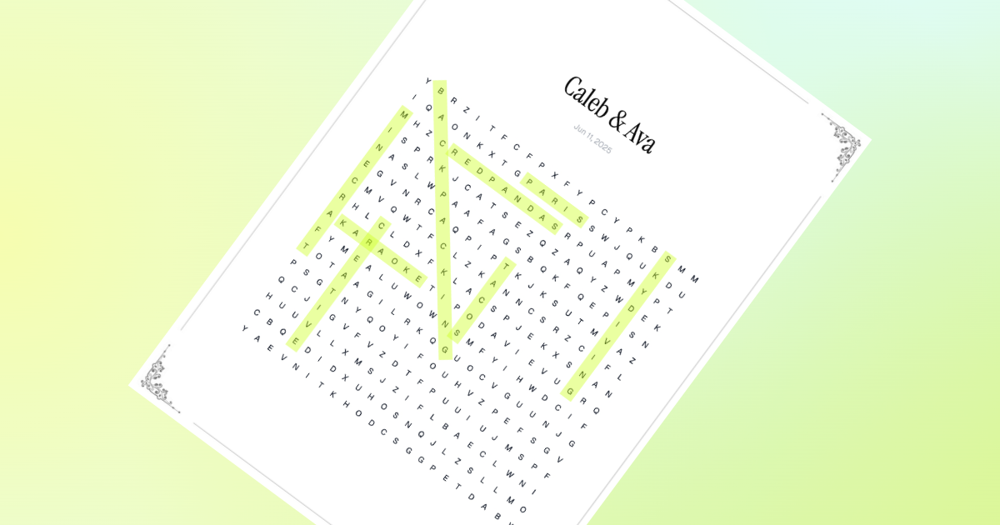

Wordamour is a personalised word search puzzle for your special someone. [Create one](https://wordamour.com)!

## Get in touch

If you have suggestions for how Wordamour could be improved or have found a bug, feel free to open an issue!

If Wordamour brings a smile to your special someone's face, consider [buying me a coffee](https://buymeacoffee.com/anandbaburajan)!

## Acknowledgements

Thanks to @blex41 for [word-search](https://github.com/blex41/word-search), @ivmarcos for [react-to-pdf](https://github.com/ivmarcos/react-to-pdf), Freepik for the corner elements in the pages, and the [other wonderful libraries](https://github.com/anandbaburajan/wordamour/blob/main/package.json) used to build Wordamour.

## License

Wordamour is distributed under the MIT [license](https://github.com/anandbaburajan/wordamour/blob/main/LICENSE).
